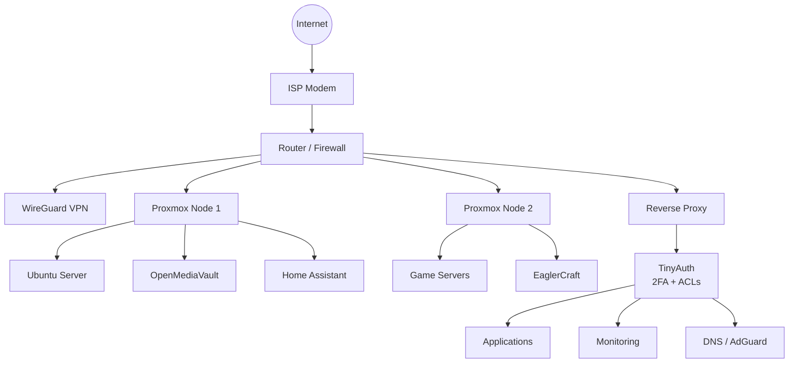

# 🏠 Rapter's Homelab

> A self-hosted homelab focused on learning, automation, networking, virtualization, security, and open-source infrastructure.

---

# 📖 About

Welcome to my homelab!

This repository documents my entire self-hosted infrastructure, including:

- Docker services
- Virtual Machines
- Networking
- DNS
- VPN
- Monitoring
- Reverse Proxy
- Mail
- Automation
- Security
- Documentation

The goal is to learn enterprise technologies while building a reliable and secure environment that can continue expanding over time.

---

# 🖥️ Infrastructure

## Hypervisor

- Proxmox VE

## Operating Systems

- Debian 12
- Ubuntu Server
- Windows

## Container Runtime

- Docker
- LXC

---

# 🌐 Network Overview

# 🚀 Services

| Service | Purpose | Status |
|----------|----------|--------|
| AdGuard Home | DNS Filtering | ✅ |
| AdGuard Sync | DNS Configuration Sync | ✅ |
| Adminer | Database Management UI | INTERNAL |
| Beszel | Server Monitoring Dashboard | ✅ |
| Beszel Agent | Monitoring Agent | INTERNAL |
| Brave Browser | Remote Browser | ✅ |
| Chromium | Remote Browser | ✅ |
| Chat | Internal Chat Application | INTERNAL |
| Cloudflared | Cloudflare Tunnel | ✅ |
| CrowdSec | Security / Threat Detection | ✅ |
| DDNS Updater | Dynamic DNS Updates | ⚠️ |
| Excalidraw | Online Diagram Editor | ✅ |
| File Browser | Web File Management | ✅ |
| Homer | Homelab Dashboard | ✅ |
| Immich | Photo & Video Management | ✅ |
| Immich Machine Learning | AI Photo Processing | INTERNAL |
| Immich PostgreSQL | Immich Database | INTERNAL |
| Immich Redis | Immich Cache | INTERNAL |
| IT Tools | Developer Utilities | ✅ |
| Komodo Core | Container Management Platform | ✅ |
| Komodo MongoDB | Komodo Database | INTERNAL |
| Komodo Periphery | Remote Container Agent | INTERNAL |
| MySQL | Database Server | INTERNAL |
| MySpeed | Internet Speed Monitoring | INTERNAl |
| n8n | Workflow Automation | ✅ |
| Navidrome | Music Streaming Server | ✅ |
| Nginx Proxy Manager Plus | Reverse Proxy | ✅ |
| Ntfy | Push Notification Server | ✅ |
| NUT WebGUI | UPS Monitoring | ✅ |
| Ollama | Local AI Model Server | ✅ |
| Open WebUI | AI Chat Interface | ✅ |
| Paperless-ngx | Document Management | ✅ |
| Paperless Broker | Document Processing Queue | INTERNAL |
| Paperless Gotenberg | Document Conversion | INTERNAL |
| Paperless Tika | Document Text Extraction | INTERNAL |
| Portainer | Docker Management | ✅ |
| Portainer Agent | Remote Docker Management | INTERNAL |
| QR Share | File / QR Sharing | INTERNAL |
| Rajendra Singh Website | Personal Website | ✅ |
| Redis | Cache Database | INTERNAL |
| Tailscale | Mesh VPN | ✅ |
| Termix | Terminal Management | ✅ |
| TinyAuth | Authentication + 2FA + ACLs | ✅ |
| Trilium | Knowledge Base / Notes | ✅ |
| Under Maintenance | Maintenance Page | INTERNAL |
| Uptime Kuma | Service Monitoring | ✅ |
| Watchtower | Automatic Container Updates | ✅ |
| WireGuard Dashboard | VPN Management | ✅ |
| ZeroByte | Backup Service | ✅ |

---

# 🔒 Security

Current security measures include:

- Reverse proxy
- HTTPS
- VPN-only management
- DNS filtering
- Firewall rules
- Docker isolation
- Automatic updates
- Least privilege

Future plans:

- Single Sign-On
- Multi-factor Authentication
- Centralized logging
- Backup server
- Crowdsec Security Engine
- ACL

---

# 🎯 Goals

- Learn enterprise networking
- Learn Linux administration
- Build production-style infrastructure
- Automate deployments
- Improve security
- Practice DevOps
- Experiment with new technologies

---

# 📊 Current Features

- Self-hosted infrastructure
- Docker stack
- DNS filtering
- VPN access
- Reverse proxy
- SSL certificates
- Monitoring
- Service dashboard
- Documentation

---

# 📅 Roadmap

## Planned

- [ ] Kubernetes
- [x] Tiny Auth
- [x] Immich
- [x] Jellyfin
- [x] Paperless-ngx
- [x] Backup automation
- [ ] High availability
- [ ] VLAN segmentation

---

# 💾 Backups

Planned backup strategy:

- Configuration backups
- Docker volumes
- VM snapshots
- Proxmox backups
- Off-site backup
- Automated backup verification

---

# 📈 Monitoring

Monitoring stack:

- Uptime monitoring
- Resource monitoring
- Log aggregation
- Alerts
- Performance metrics

---

# 🤝 Contributing

This repository is primarily for documenting my personal homelab, but suggestions and ideas are always welcome.

---

# ⭐ Project Status

🚀 Active Development

This homelab is constantly evolving as I learn new technologies and improve my infrastructure.